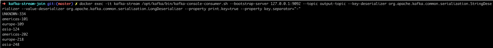

## What is this app?

Spring Cloud Stream Kafka adaptation of the [confluent blog example](https://www.confluent.io/blog/distributed-real-time-joins-and-aggregations-on-user-activity-events-using-kafka-streams/)

## Running the app:


````bash
docker-compose up -d
````

```bash
./mvnw clean package
```

````bash
java -jar target/kafka-stream-join-0.0.1-SNAPSHOT.jar
````


Produce a sample data using Producers application few times.

Play time, run the kafka consumer: 

```bash
docker exec -it kafka-stream /opt/kafka/bin/kafka-console-consumer.sh --bootstrap-server 127.0.0.1:9092 --topic output-topic --key-deserializer org.apache.kafka.common.serialization.StringDeserializer --value-deserializer org.apache.kafka.common.serialization.LongDeserializer --property print.key=true --property key.separator="-"
```

